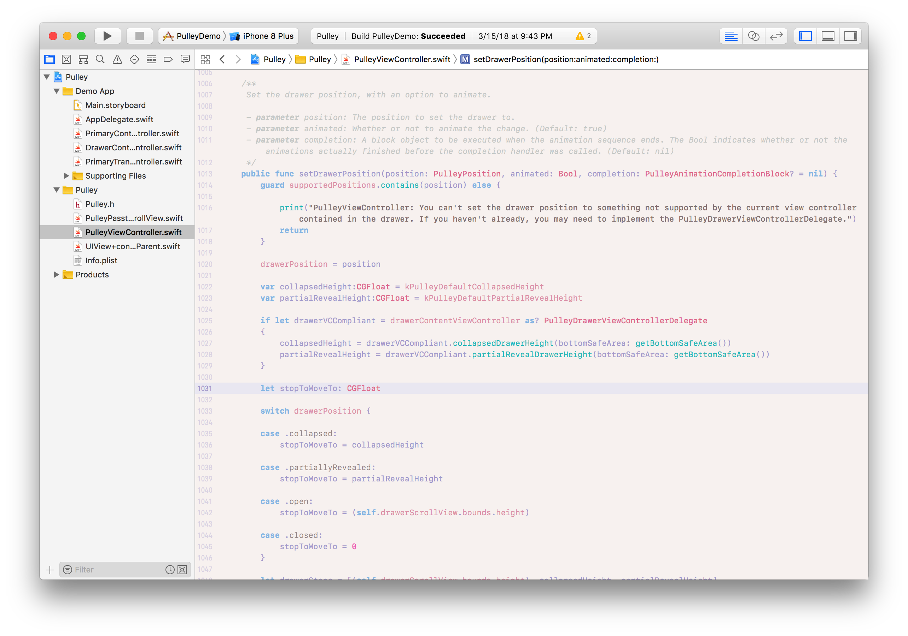

# \~ soft era \~

### syntax theme for [Xcode](https://developer.apple.com/xcode/)

🌸 Light pastel syntax theme for soft, warm, cozy, cute coding. 🌱

\~.\~
 &nbsp;&nbsp;a soft, warm, low contrast theme,
 &nbsp;&nbsp;with pastel accents that are easy on your eyes

^.^
 &nbsp;&nbsp;make stuff and learn.
 &nbsp;&nbsp;make the world your kinda place.
 &nbsp;&nbsp;take care of the people around you

🌿

## Installation

* Close **Xcode**
* Navigate to `~/Library/Developer/Xcode/UserData/FontAndColorThemes` in **Finder**
	* Create the folder if it doesn't exist.
* Move `~ soft era ~.xccolortheme` to that folder.
* Launch **Xcode**
	* Open 'Xcode' -> Preferences from the menu bar.
* Open the "Fonts & Colors" panel.
* Choose '~ soft era ~' from the list on the left.
	* It may be at the bottom, so if you don't see it try scrolling down.

💾 enjoy <3

---

Happy to hear any input <3

💖 [@animalphase](https://twitter.com/animalphase) on twitter
